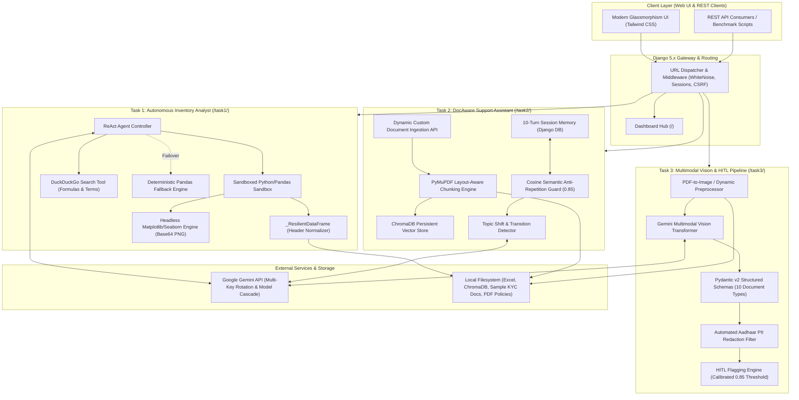

# Enterprise AI Assignment Suite (Django 5.x)
**Unified Multi-Agent & Multimodal AI Application Suite**  
*Data Science Technical Assessment Submission for DesiCrew Solutions*

[](https://www.djangoproject.com/)
[](https://www.python.org/)
[](https://ai.google.dev/)
[](https://www.trychroma.com/)
[](https://pymupdf.readthedocs.io/)
[](https://pandas.pydata.org/)
[]()

---

## Executive Overview

This repository hosts a production-grade, modular **Enterprise AI Suite** built on **Django 5.x**, implementing all three technical problems presented in `Questions.docx`:

| Module | Route | Key Capabilities | Underlying Technologies |
| :--- | :--- | :--- | :--- |
| **Task 1: Inventory Data Analyst Agent** | [`/task1/`](http://localhost:8000/task1/) | Autonomous ReAct agent over Excel inventory data; sandboxed Python/Pandas code execution; DuckDuckGo live search; headless chart generation; deterministic offline fallback. | Google Gemini Function Calling, Pandas, NumPy, Matplotlib (Agg), DuckDuckGo Search |
| **Task 2: DocAware Multi-Turn Support Assistant** | [`/task2/`](http://localhost:8000/task2/) | Document-grounded support chat; 10+ turn persistent session memory; cosine semantic anti-repetition filter; graceful topic switching; strict granular document citations. | PyMuPDF, ChromaDB Vector Store, Gemini Flash Cascading, Cosine Anti-Repetition Guard |
| **Task 3: Multimodal Document Scanner & HITL Pipeline** | [`/task3/`](http://localhost:8000/task3/) | Visual classification and extraction across 10 document types (printed IDs + handwritten insurance forms); per-field confidence scoring; PII redaction; 0.85 threshold HITL audit report. | Gemini Multimodal Vision, Pydantic v2, PyMuPDF, PIL, High-Risk Field Flagging Engine |

---

## System Architecture



---

## Detailed Task Implementations

### Task 1: Autonomous Inventory Data Analyst Agent (`/task1/`)

Built to answer complex, ad-hoc queries over the provided enterprise inventory dataset (`Inventory-Records-Sample-Data.xlsx`, 46 active SKUs across categories such as Electronics, Office Furniture, Storage, Accessories, and Network Supplies).

* **ReAct Agent Loop**:
  The agent reasons about the query, formulates deterministic Python/Pandas code, executes it in a sandboxed runtime, observes the output, optionally queries DuckDuckGo for external supply chain domain knowledge, and synthesizes an executive summary in plain English.
* **Deterministic Sandboxed Execution**:
  * **AST Pre-Screening & Scope Isolation**: Disallows arbitrary file I/O, subprocesses, network socket creation, and dangerous built-ins (`eval`, `exec`, `__import__`, `open`, `os`, `sys`).
  * **Memory Immutability**: All executions run on an isolated deep copy (`ORIGINAL_DF.copy(deep=True)`). Session-calculated metrics (`Inventory_Turnover_Proxy`, `Stock_Cover`, etc.) never leak into the official 8-column Excel schema.
* **`_ResilientDataFrame` Header Normalizer**:
  Raw business spreadsheets frequently contain typographical whitespace artifacts (e.g., `'Cost Price  Per Unit (USD)'` with double spaces, or `'Hand-In- Stock'` with trailing spaces). The custom `_ResilientDataFrame` uses an $O(1)$ cached normalized column resolver that transparently resolves arbitrary spacing and casing variations without altering the true underlying schema.
* **Headless Chart Generation**:
  Generates charts using Seaborn and Matplotlib configured with the non-blocking `Agg` backend. Figures are captured in-memory via `io.BytesIO`, serialized to Base64 PNGs, and returned directly to the chat interface. All figures are safely closed via `plt.close("all")` to eliminate memory leaks.
* **Deterministic Offline Fallback Engine**:
  If the Gemini API key is missing, invalid, or rate-limited (HTTP 429), the system seamlessly fails over to an offline deterministic Pandas engine that accurately computes column schemas, top sellers, low stock replenishment lists, catalog valuations, and mean inventory metrics.
* **Interactive Data Playground & Insights**:
  Includes a built-in Python/Pandas code playground modal (`/task1/api/playground/`) and 5 instant analytical insight generators (`low_stock`, `top_sellers`, `abc`, `sell_through`, `price_velocity`).

---

### Task 2: DocAware Multi-Turn Support Assistant (`/task2/`)

A document-grounded support assistant using company policy manuals as a knowledge base, maintaining full multi-turn conversational context while avoiding repetitive boilerplate.

* **Knowledge Base Ingestion & Vector Retrieval**:
  * Ingests core policy documents: `Customer_Support_Policy.pdf`, `Account_Security_Privacy.pdf`, and `Subscription_Billing_Guide.pdf`.
  * Parsed via **PyMuPDF (`fitz`)** preserving document layout, hierarchical headings, page numbers, and exact section titles.
  * Chunks are stored in a persistent local **ChromaDB** collection with rich metadata.
* **10-Turn Conversational Memory**:
  * Backed by Django database sessions (`SessionMemory`) with support for multi-chat session switching (`chat_id`).
  * Maintains conversation turns, active topics, visited topic histories, covered documents, and logged delivered facts.
* **Cosine Semantic Anti-Repetition Guard**:
  * Computes normalized term-frequency cosine similarity against prior assistant responses in the active session.
  * If cosine similarity exceeds **0.85** or if key fact tokens were already delivered, the anti-repetition mechanism triggers automatically:
    > *"Directive: The user has previously received core information on this topic in earlier turns. Do NOT repeat the general baseline boilerplate. Directly answer their specific question with novel details or a concise summary."*
* **Graceful Topic Switching Engine**:
  * Tracks topic transitions (e.g., transitioning from *SLA Response Windows* to *Refund & Cancellation Terms* to *MFA Requirements*).
  * Smoothly acknowledges topic transitions and seamlessly recalls earlier context when returning to a previously discussed topic.
* **Strict Granular Citations**:
  * Every factual response is mandated to cite its exact document source in the standard format:
    `[Doc: <filename>, Page: <page_number>, Section: <section_title>]`
* **Automated 10-Turn Benchmark**:
  * Verified across a rigorous 10-turn benchmark script (`run_10_turn_demo.py`) covering 7 topic switches, intra-topic follow-ups, and anti-repetition triggers with 100% citation compliance.

---

### Task 3: Multimodal Document Extraction & HITL Quality Pipeline (`/task3/`)

An automated document processing pipeline handling 10 mixed Indian KYC identity proofs and complex handwritten insurance proposal forms.

#### Supported Document Types & Extraction Targets

| Category | Document Type | Mandatory Fields Extracted | Format |
| :--- | :--- | :--- | :--- |
| **Statutory ID** | **Aadhaar Card** | Aadhaar Number (12 digits, PII-masked), Full Name, Date of Birth, Address | Printed |
| **Statutory ID** | **PAN Card** | PAN Number (10 alphanumeric), Full Name, Father's Name, Date of Birth | Printed |
| **Statutory ID** | **Driving Licence** | DL Number, Name, Date of Issue, Valid Till Date | Printed |
| **Statutory ID** | **Passport** | Passport Number, Date of Birth, Date of Expiry, MRZ Line 2 | Printed |
| **Insurance Form** | **NACH / ECS Mandate** | Bank Account Number, IFSC Code, Bank Name, Amount (figures), Frequency | Handwritten |
| **Insurance Form** | **FATCA Annexure** | Policy Number, TIN / PAN, Father's Name, Place of Birth, Nationality | Handwritten |
| **Insurance Form** | **Benefit Illustration** | Application Number, Policyholder Name, Date, Place | Handwritten |
| **Insurance Form** | **Moral Hazard Questionnaire** | Application Number, Name of Life Assured, Nominee Relationship, Date, Place | Handwritten |
| **Insurance Form** | **Multiple Policies Consent** | Proposer Name, Reason for Multiple Policies (checkbox), Date, Place | Handwritten |
| **Insurance Form** | **Suitability Profiler** | Application Number, Name of Life Assured, Name of Agent/SP, Date, Place | Handwritten |

#### Quality Flagging & Human-in-the-Loop (HITL) Architecture

* **Chosen Confidence Threshold: `0.85 (85%)`**
  * `Confidence >= 0.85` ➔ **PASS / Straight-Through Processing (STP)**
  * `Confidence < 0.85` ➔ **FLAGGED FOR HUMAN REVIEW**
  * `Missing Mandatory Field` ➔ **FLAGGED FOR HUMAN REVIEW**
* **Engineering Rationale**:
  A confidence threshold of 0.85 was selected as an engineering threshold to balance automated straight-through processing throughput with extraction reliability. Fields below this threshold are sent for human review because incorrect extraction of identity identifiers, banking coordinates (IFSC, Account Number), insurance policies, or date-related fields carries significant downstream operational and compliance risks (such as dishonored mandate debits or invalidated KYC filings).
* **Printed vs. Handwritten Methodology**:
  * **Unified Multimodal Architecture**: Rather than relying on traditional OCR pipelines that struggle with cursive handwriting, the pipeline processes images directly via Gemini's native multimodal vision transformer.
  * **Printed Typography**: High contrast, uniform aspect ratios, and predictable structural landmarks yield high-precision zero-shot extraction (confidence typically > 0.95).
  * **Handwritten Forms**: Explicitly detects and tags forms containing handwriting (`is_handwritten: true`). Focuses prompt attention on cursive pen strokes, baseline drift, and critical financial tokens. Uncertain fields (< 0.85) are automatically isolated into the `flagging_report`.
* **Mandatory PII Redaction**:
  * Aadhaar card numbers are automatically masked (`[Aadhaar Redacted]`) before storage and display to comply with statutory UIDAI privacy guidelines.
* **Empirical Verification Against Ground Truth**:
  * Evaluated against `data/ground_truth.json`: **100% document classification accuracy** (10/10) and **100% mandatory field capture** across all test documents.

---

## Repository Structure

```text
.
├── CHALLENGES.md                        # Technical post-mortem: 12 production challenges & fixes
├── Questions.docx                       # Original assessment problem statement
├── README.md                            # Comprehensive project manual & reference guide
├── SUBMISSION_REPORT.md                 # Full candidate evaluation report & empirical benchmarks
├── requirements.txt                     # Pinned Python package dependencies
├── .env.example                         # Environment configuration template
├── Question 1 & 3 (Files to use)/       # Reference datasets & test sample documents
└── ai_assignment/                       # Core Django project root
    ├── manage.py                        # Django management CLI
    ├── db.sqlite3                       # Local SQLite database (sessions & migrations)
    ├── ai_assignment/                   # Project configuration
    │   ├── asgi.py                      # ASGI entrypoint
    │   ├── settings.py                  # Settings (apps, Whitenoise, Gemini keys, session)
    │   ├── urls.py                      # Master URL routing & landing dashboard
    │   └── wsgi.py                      # WSGI entrypoint
    ├── data/                            # Persistent datasets & corpora
    │   ├── Inventory-Records-Sample-Data.xlsx  # 46-SKU Inventory dataset (Task 1)
    │   ├── ground_truth.json            # Ground truth answer key (Task 3)
    │   ├── chroma_db/                   # Persistent ChromaDB vector database (Task 2)
    │   ├── sample_documents/            # 10 reference KYC images and scanned PDFs (Task 3)
    │   └── support_documents/           # Policy PDFs and markdown manuals (Task 2)
    ├── media/                           # User-uploaded documents and mandate scans
    ├── static/                          # Favicons and web assets
    ├── templates/                       # Base templates and landing dashboard
    │   ├── home.html                    # Glassmorphism suite landing hub
    │   └── partials/                    # Tailwind, icons, and theme partials
    ├── task1_agent/                     # Task 1 Application (Inventory Analyst)
    │   ├── analysis.py                  # Resilient DataFrame, AST sandbox, insight builders
    │   ├── tools.py                     # Tool wrappers (execute_pandas_code, search_web)
    │   ├── urls.py                      # Task 1 routing
    │   ├── views.py                     # ReAct loop, Gemini function calling, fallback
    │   └── templates/task1_agent/       # Chat interface & code playground
    ├── task2_support/                   # Task 2 Application (DocAware Support)
    │   ├── engine.py                    # PyMuPDF parser, chunking, ChromaDB RAG engine
    │   ├── memory.py                    # 10-turn session memory, cosine anti-repetition
    │   ├── run_10_turn_demo.py          # Standalone 10-turn benchmark audit script
    │   ├── urls.py                      # Task 2 routing
    │   ├── views.py                     # Multi-turn RAG chat, topic detection, upload API
    │   └── templates/task2_support/     # Support assistant chat interface
    └── task3_vision/                    # Task 3 Application (Multimodal Scanner)
        ├── pipeline.py                  # Vision transformer pipeline, PII redaction, flagging
        ├── schemas.py                   # Pydantic v2 schemas for all 10 document types
        ├── urls.py                      # Task 3 routing
        ├── views.py                     # Document processing & preview API endpoints
        └── templates/task3_vision/      # Split-screen extraction & audit dashboard
```

---

## Installation & Local Development

### Prerequisites

* **Python 3.10, 3.11, or 3.12**
* **pip** (Python package manager)
* (Optional) **Poppler** (if converting scanned multi-page PDFs to images via `pdf2image`; fallback rendering is natively handled by `pymupdf`)

### 1. Clone the Repository & Create Virtual Environment

#### On Windows (PowerShell):
```powershell
git clone <repository-url>
cd Assessments-DesiCrew

python -m venv venv
.\venv\Scripts\Activate.ps1
```

#### On Linux / macOS:
```bash
git clone <repository-url>
cd Assessments-DesiCrew

python3 -m venv venv
source venv/bin/activate
```

### 2. Install Dependencies

```bash
pip install -r requirements.txt
```

### 3. Configure Environment Variables

Copy `.env.example` to create `.env`:

```bash
cp .env.example .env
```

Edit `.env` to supply your Google Gemini API key:

```env
# Gemini API Key for Tasks 1, 2, and 3
GEMINI_API_KEY="your-gemini-api-key"

# Optional: Multiple keys for automatic failover rotation
# GEMINI_API_KEYS="key-1,key-2,key-3"

# Django settings
SECRET_KEY="django-insecure-ai-assignment-suite-secret-key-2026"
DEBUG=True
ALLOWED_HOSTS=*
```

> [!NOTE]
> Even without a `GEMINI_API_KEY`, the application starts normally:
> * **Task 1** uses its built-in deterministic Pandas fallback engine.
> * **Task 2** uses in-memory/ChromaDB lexical and semantic retrieval with templated responses.
> * Adding a valid Gemini API key enables full dynamic generative reasoning, automatic function calling, and multimodal pixel extraction.

### 4. Run Migrations & Start the Development Server

```bash
cd ai_assignment
python manage.py migrate
python manage.py runserver 8000
```

Open your browser and navigate to:
**[http://127.0.0.1:8000/](http://127.0.0.1:8000/)**

---

## Configuration & Environment Variables

| Variable | Type | Default | Description |
| :--- | :---: | :---: | :--- |
| `GEMINI_API_KEY` | String | `""` | Primary Google Gemini API key used across all three tasks. |
| `GEMINI_API_KEYS` | String (CSV) | `""` | Comma-separated pool of Gemini keys for automatic quota failover rotation. |
| `SECRET_KEY` | String | Django default | Django cryptographic signing secret key. |
| `DEBUG` | Boolean | `True` | Set to `False` in production deployments. |
| `ALLOWED_HOSTS` | String (CSV) | `*` | Allowed hostnames/domain names. |
| `CSRF_TRUSTED_ORIGINS`| String (CSV) | `localhost,127.0.0.1` | Trusted origins for CSRF POST requests. |

### API Key Rotation & Model Cascading
To prevent service disruptions from free-tier rate limits (e.g. 20 req/day on newer models), the system implements automatic key rotation and model cascading:
1. Iterates over keys supplied in `GEMINI_API_KEYS`.
2. Automatically tries candidate models in order: `gemini-3.5-flash` → `gemini-3.8-flash` → `gemini-3.1-flash-lite` → `gemini-flash-latest` → `gemini-2.5-flash-lite`.
3. If all API keys are exhausted, Task 1 cleanly drops into its offline deterministic Pandas engine with zero user crash.

---

## Complete REST API Reference

### Suite Dashboard

* **`GET /`**  
  Renders the main glassmorphism landing dashboard linking to all three workspace modules with live environment health metrics.

---

### Task 1: Inventory Data Analyst Agent

#### 1. Chat & ReAct Agent Query
* **Endpoint**: `POST /task1/api/chat/`
* **Payload**:
  ```json
  {
    "message": "What is the average inventory quantity per record?",
    "history": []
  }
  ```
* **Response**:
  ```json
  {
    "reply": "The average inventory quantity per record is **43.57 units** (based on Hand-In-Stock across all 46 products).",
    "code_executed": "print(df['Hand-In-Stock'].mean())",
    "search_query": null,
    "charts": []
  }
  ```

#### 2. Code Playground Execution
* **Endpoint**: `POST /task1/api/playground/`
* **Payload**:
  ```json
  {
    "code": "print(df.groupby('Product ID')['Cost Price Total (USD)'].sum().head(3))"
  }
  ```
* **Response**:
  ```json
  {
    "status": "success",
    "output": "Product ID\nPROD-001    12500\nPROD-002     8400\nPROD-003    19200\nName: Cost Price Total (USD), dtype: int64",
    "charts": []
  }
  ```

#### 3. Dataset Info & Schema
* **Endpoint**: `GET /task1/api/data_info/`
* **Response**:
  ```json
  {
    "dataset_name": "Inventory-Records-Sample-Data.xlsx",
    "row_count": 46,
    "column_count": 8,
    "columns": ["Product ID", "Product Name", "Opening Stock", "Purchase/ Stock in", "Number of Units Sold", "Hand-In-Stock", "Cost Price Per Unit (USD)", "Cost Price Total (USD)"],
    "dtypes": { "Product ID": "object", "Hand-In-Stock": "int64", ... }
  }
  ```

#### 4. Pre-Built Inventory Insights
* **Endpoint**: `POST /task1/api/insight/`
* **Payload**: `{"insight": "low_stock"}` *(options: `low_stock`, `top_sellers`, `abc`, `sell_through`, `price_velocity`)*
* **Response**: Contains analytical markdown summary, executed Python code, and Base64-encoded Matplotlib chart.

---

### Task 2: DocAware Support Assistant

#### 1. Multi-Turn RAG Chat
* **Endpoint**: `POST /task2/api/support_chat/` (alias: `POST /task2/api/chat/`)
* **Payload**:
  ```json
  {
    "message": "What is your SLA response time for Critical P1 outages?",
    "chat_id": "session-xyz"
  }
  ```
* **Response**:
  ```json
  {
    "reply": "For Critical P1 severity outages, initial response is guaranteed within 15 minutes with 24/7 dedicated engineering coverage [Doc: Customer_Support_Policy.pdf, Page: 2, Section: Service Level Agreements (SLAs) & Response Windows].",
    "citation": "[Doc: Customer_Support_Policy.pdf, Page: 2, Section: Service Level Agreements (SLAs) & Response Windows]",
    "topic": "Service Level Agreements (SLAs) & Response Windows",
    "is_topic_switch": false,
    "anti_repeat": false,
    "turn_number": 1,
    "total_turns": 1,
    "sources": [
      {
        "citation": "[Doc: Customer_Support_Policy.pdf, Page: 2, Section: Service Level Agreements (SLAs) & Response Windows]",
        "excerpt": "Critical P1 incidents receive an initial response within 15 minutes..."
      }
    ]
  }
  ```

#### 2. Dynamic Document Upload & Indexing
* **Endpoint**: `POST /task2/api/upload/` (multipart/form-data)
* **Parameters**: `file` (PDF, DOCX, TXT, or Image)
* **Response**:
  ```json
  {
    "success": true,
    "filename": "Warranty_Addendum.pdf",
    "chunks_indexed": 6,
    "status": "Document parsed and indexed into ChromaDB knowledge base."
  }
  ```

#### 3. Session Reset
* **Endpoint**: `POST /task2/api/reset/`
* **Payload**: `{"chat_id": "session-xyz"}`
* **Response**: `{"status": "Session memory reset successfully.", "turn_count": 0}`

---

### Task 3: Multimodal Document Scanner

#### 1. Process Document (File Upload or Sample)
* **Endpoint**: `POST /task3/api/process/` (alias: `POST /task3/api/upload/`)
* **Payload (Multipart or Form-Data)**:
  * Upload custom file: `file=@Aadhar.png`
  * OR reference sample file: `sample_filename=ECS.jpeg`
* **Response**:
  ```json
  {
    "document_filename": "ECS.jpeg",
    "document_type": "NACH / ECS Mandate",
    "classification_confidence": 0.96,
    "is_handwritten": true,
    "overall_confidence": 0.942,
    "needs_human_review": false,
    "fields": {
      "Bank Account Number": { "value": "31004258912", "confidence": 0.97, "method": "Multimodal Vision" },
      "IFSC Code": { "value": "SBIN0227112", "confidence": 0.96, "method": "Multimodal Vision" },
      "Bank Name": { "value": "State Bank of India", "confidence": 0.98, "method": "Multimodal Vision" },
      "Amount (figures)": { "value": "50,000", "confidence": 0.95, "method": "Multimodal Vision" },
      "Frequency": { "value": "As & when presented", "confidence": 0.85, "method": "Multimodal Vision" }
    },
    "flagging_report": {
      "confidence_threshold": 0.85,
      "total_fields_extracted": 5,
      "total_flagged_fields": 0,
      "flagged_fields": [],
      "needs_human_review": false
    }
  }
  ```

#### 2. Side-by-Side Sample Image Server
* **Endpoint**: `GET /task3/api/sample/?name=Aadhar.png&render=1`
* **Response**: Serves raw image or dynamically rendered PDF first page as image/png.

#### 3. Full 10-Document Batch Pipeline Audit
* **Endpoint**: `GET /task3/api/pipeline/`
* **Response**: Runs extraction on all 10 sample KYC and insurance documents, returning aggregate classification results and the complete compliance flagging report.

---

## Automated Benchmark Scripts & Verification

### Running the Task 2 10-Turn Support Benchmark

To verify context retention, topic switching, anti-repetition guardrails, and citation precision across 10 consecutive turns:

```bash
# From repository root
python ai_assignment/task2_support/run_10_turn_demo.py
```

#### Benchmark Trace Highlights:

| Turn | User Query | Detected Topic | Handled Behavior | Specific Citation |
| :---: | :--- | :--- | :--- | :--- |
| **T1** | *"What is your SLA response time for Critical P1 outages?"* | SLAs & Response Windows | Baseline Policy Retrieval | `[Doc: Customer_Support_Policy.pdf, Page: 2, Section: SLAs...]` |
| **T2** | *"What about Standard P3 severity issues?"* | SLAs & Response Windows | Intra-topic follow-up; retains P1 context | `[Doc: Customer_Support_Policy.pdf, Page: 2, Section: SLAs...]` |
| **T3** | *"Can I get a refund if I cancel my annual subscription?"* | Refund & Cancellation | **Topic Switch 1** (SLA ➔ Billing) | `[Doc: Customer_Support_Policy.pdf, Page: 3, Section: Refund...]` |
| **T4** | *"How many days does it take for the refund money to reach my account?"* | Refund & Cancellation | Timeline follow-up | `[Doc: Customer_Support_Policy.pdf, Page: 3, Section: Refund...]` |
| **T5** | *"Could you remind me of the refund terms for annual plans?"* | Refund & Cancellation | **Anti-Repetition Triggered** (Suppresses duplicate boilerplate) | `[Doc: Customer_Support_Policy.pdf, Page: 3, Section: Refund...]` |
| **T6** | *"Is multi-factor authentication mandatory for admin accounts?"* | MFA Requirements | **Topic Switch 2** (Billing ➔ Security) | `[Doc: Account_Security_Privacy.pdf, Page: 2, Section: MFA...]` |
| **T7** | *"What is the protocol if an administrator loses both password and 2FA recovery codes?"* | Password Reset & Verification | **Topic Switch 3** (Shift to Recovery) | `[Doc: Account_Security_Privacy.pdf, Page: 3, Section: Password...]` |
| **T8** | *"What features and pricing are included in the Professional Plan?"* | Tiers & Pricing Model | **Topic Switch 4** (Shift to Pricing) | `[Doc: Subscription_Billing_Guide.pdf, Page: 2, Section: Pricing...]` |
| **T9** | *"Does warranty cover physical drop damage or liquid spills?"* | Warranty Coverage | **Topic Switch 5** (Return to Support) | `[Doc: Customer_Support_Policy.pdf, Page: 4, Section: Warranty...]` |
| **T10**| *"How long before a missing package is officially declared Lost in Transit?"* | Damaged or Lost Shipments | **Topic Switch 6** (Shift to Logistics) | `[Doc: Customer_Support_Policy.pdf, Page: 5, Section: Shipments...]` |

### Verifying Django System Integrity

```bash
cd ai_assignment
python manage.py check
```
*Expected output: `System check identified no issues (0 silenced).`*

---

## Production Engineering Highlights & Solved Challenges

During development and stress-testing, 12 critical technical challenges were identified and systematically resolved (see `CHALLENGES.md` for full post-mortem):

1. **Session Contamination & Schema Hallucination**:
   Prevented temporary session-calculated metrics (such as turnover proxy) from masquerading as Excel columns by enforcing an immutable `ORIGINAL_DF` baseline and executing on deep copies.
2. **Messy Excel Headers & Whitespace Crashes**:
   Built `_ResilientDataFrame` to handle double spaces (`'Cost Price  Per Unit (USD)'`) and trailing spaces without mutating original spreadsheet headers.
3. **Ambiguity Over-Hedging**:
   Mapped canonical business terms (`inventory quantity` $\rightarrow$ `Hand-In-Stock`) and instructed the ReAct agent to deliver direct answers before offering comparisons.
4. **Aggregation Fidelity (Mean vs. Sum)**:
   Enforced strict mathematical validation in prompts and deterministic fallbacks to prevent the agent from substituting total sums when means were requested.
5. **Headless Chart Generation & Memory Leaks**:
   Configured Matplotlib to headless `Agg` mode with in-memory `io.BytesIO` capture and automatic `plt.close("all")` lifecycle cleanup to prevent UI thread freezes and memory leaks.
6. **API Quota Management & Failover Cascading**:
   Implemented multi-key pool rotation, model cascading across 5 Gemini models, and an offline deterministic Pandas engine for zero-downtime resiliency.
7. **AST Security Sandbox**:
   Protected dynamic code execution via AST parsing, scope restriction, and blacklisting unauthorized imports or OS-level calls.
8. **Calibrated 0.85 HITL Quality Threshold**:
   Selected an 0.85 threshold to safeguard critical banking coordinates (IFSC, bank account numbers, dates) while preserving high straight-through automation.
9. **Handwritten vs. Printed Multimodal Processing**:
   Addressed cursive baseline drift and 0/O ambiguity by feeding raw pixels directly to multimodal transformers rather than error-prone traditional OCR engines.

---

## Additional Documentation

* **[`SUBMISSION_REPORT.md`](file:///C:/Users/hbp/Desktop/Assessments-DesiCrew/SUBMISSION_REPORT.md)**: Comprehensive evaluation report with empirical benchmarks, technical answers, methodology notes, and ground-truth validation scores.
* **[`CHALLENGES.md`](file:///C:/Users/hbp/Desktop/Assessments-DesiCrew/CHALLENGES.md)**: Deep-dive engineering log and architectural post-mortem documenting all 12 production challenges and their verified resolutions.

---

## License & Evaluation Credits

Developed for the **DesiCrew Solutions Data Science Assessment (October 2026)**.  
Built with Django 5.x, Google Gemini, ChromaDB, PyMuPDF, and Pandas.
